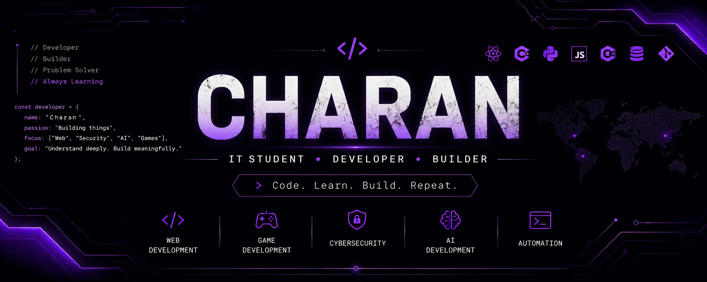

<p align="center">
  
</p>

# 👋 Hey, I'm Charan Raj R K

### IT Student • Developer • Builder

I learn by building.

I enjoy turning ideas into working projects and exploring how software works — from web applications and games to cybersecurity, automation, and AI.

🌐 **[Visit my Portfolio](https://charanrajrk.vercel.app/)**

---

## 🚀 What I Do

* 🌐 Build web applications
* 🎮 Explore game development
* 🔐 Learn cybersecurity
* 🤖 Explore AI development
* ⚙️ Experiment with automation
* 🧩 Build projects to understand how things work

---

## 🛠️ Tech Stack

### Languages

`C` `C++` `C#` `Java` `Python` `JavaScript` `PHP`

### Web

`HTML` `CSS` `JavaScript` `React` `XML`

### Databases & Backend

`MySQL` `Firebase` `Supabase`

### Data & AI

`Pandas` `NumPy`

### Tools

`Git` `GitHub` `Docker` `VirtualBox`

### Cybersecurity

`Kali Linux` `TryHackMe` `Hack The Box`

---

## 🔥 Featured Projects

### ☕ Mamak Cafe

A modern restaurant website built with React and Tailwind CSS.

🌐 **[Live Project](https://mamak-cafe.vercel.app/)**

---

### 🧑‍💻 MigrantCarePlus

A web application built with Flask, MySQL, HTML, CSS and JavaScript.

---

### 🎮 2D Platform Runner

A 2D game developed using Unity and C#.

---

### 🤖 Game Automation

An automation project exploring repetitive gameplay actions and automation concepts.

---

### 🌐 SQS Community Hub

A community-focused web platform.

🌐 **[Live Project](https://sqs-community-hub.vercel.app/)**

---

## 🧭 My Journey

```text
2024  ── Started Coding
          │
2025  ── Web Development
          │
2025  ── Unity & Game Development
          │
2025  ── Cybersecurity
          │
2026  ── AI Development
          │
2026  ── Building Serious Projects
```

---

## 🎯 Currently Exploring

```text
Web Development
        ↓
Cybersecurity
        ↓
AI Development
        ↓
AI + Cybersecurity
```

I'm interested in understanding how these areas can work together.

---

## 🌐 Find Me

🌐 **Portfolio**
https://charanrajrk.vercel.app/

💻 **GitHub**
https://github.com/rkcharanraj835-art

💼 **LinkedIn**
https://www.linkedin.com/in/charan-raj-r-k-b5aa69328/

---

## ⚡ Philosophy

> I don't want to just learn technologies.
> I want to understand them by building with them.

---

### Thanks for stopping by 👋

⭐ Explore my repositories and projects.
